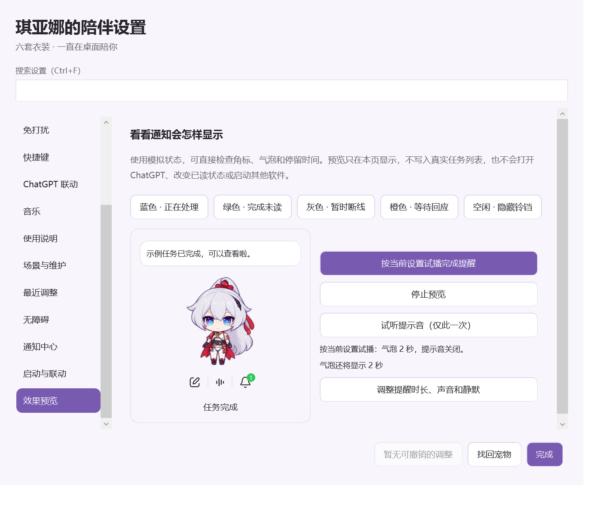
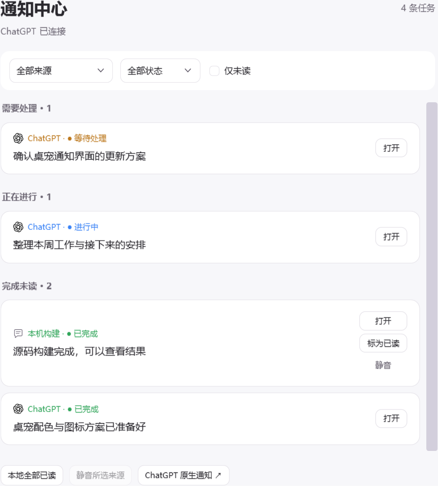
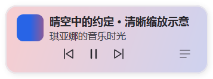
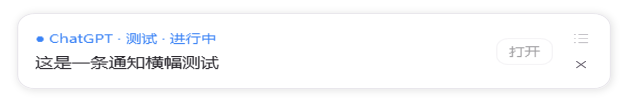
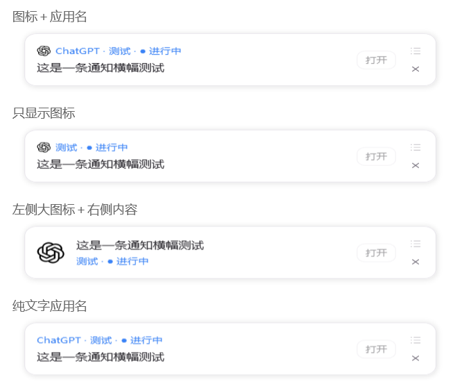

# 琪亚娜独立桌宠

## 效果演示







## 安装方法

适用 Windows 10/11 x64，需 .NET Framework 4.8。已安装 Git 的电脑可在 PowerShell 中运行：

```powershell
git clone https://github.com/FeiyangHong/Kiana-Desktop-Pet.git
cd Kiana-Desktop-Pet
.\build-release.ps1
.\dist\Kiana-Desktop-Pet-0.7.12-Windows\install.ps1 -InstallRoot 'E:\Kiana-Desktop-Pet\runtime\KianaDesktopPet'
```

`-InstallRoot` 可改为本机希望保存程序、设置与日志的目录；ChatGPT 平滑联动组件会装在其同级的 `KianaSmoothPet`。首次启动桌宠请使用安装器生成的“琪亚娜桌宠”快捷方式。另一台电脑拉取更新后重新构建、安装即可；本机设置会保留并在更新前备份。

## 从 Git 仓库更新与开发

已安装本版本后，在 **设置 → 场景与维护 → 仓库更新** 使用两个按钮：

| 入口 | 行为 |
| --- | --- |
| 拉取 GitHub 更新并应用 | 检查未提交修改，执行 `git pull --ff-only`，构建、校验、备份并重启 |
| 构建并运行本机修改 | 不拉取，直接构建当前源码，保留未提交修改，部署并重启 |

仓库根目录也提供 [拉取更新并运行.cmd](拉取更新并运行.cmd) 和 [构建本机修改并运行.cmd](构建本机修改并运行.cmd)，可直接双击。进度窗口会保留成功或错误信息，按回车关闭。需要 Git、.NET Framework 4.8 和 PowerShell 7；脚本优先使用系统 PowerShell 7，也可使用本机已有的 Codex 运行时。

运行目录在仓库的 `runtime/KianaDesktopPet` 下时，设置自动识别仓库；其他位置可用“选择本机仓库目录…”绑定。**首次使用新脚本，建议从当前桌宠的设置按钮运行一次**，它会记录当前安装目录。此后根目录脚本使用相同目录；没有绑定时默认使用本仓库的 `runtime/KianaDesktopPet`。也可以显式指定：

```powershell
# PowerShell 7；路径按本机实际位置填写
.\scripts\Repository-Deploy.ps1 -Mode build -InstallRoot 'F:\Kiana-Desktop-Pet\runtime\KianaDesktopPet'
.\scripts\Repository-Deploy.ps1 -Mode update -InstallRoot 'F:\Kiana-Desktop-Pet\runtime\KianaDesktopPet'
```

脚本先完成构建和包校验，再让当前安装保存、退出。构建、网络或 Git 检查失败时，运行中的桌宠不受影响；重复启动更新会被拦截。不会自动提交、推送、暂存、覆盖本地修改或解决分叉。ChatGPT 平滑组件及其会话保持原样。程序备份在运行目录的 `managed-backups/`，最近部署日志在 `.local/last-deploy.log`。

两台电脑分别保留自己的仓库路径、偏好与联动会话；`runtime/` 和 `.local/` 已由 Git 忽略。源码修改经测试后自行提交、推送，另一台再“拉取 GitHub 更新并应用”。仅执行 `git pull` 不会替换正在运行的程序。通用偏好仍通过设置导出/导入，不复制整个运行目录。

## 通知速览



鼠标在铃铛上停留片刻会展开速览，移开后自动收起；首次点击铃铛会固定展开，点空白处、关闭按钮或按 Esc 收起。浮窗优先列出需要处理和正在进行的任务，默认使用 420 宽的单条紧凑横幅，只显示状态、任务标题和快捷操作；在 **设置 → 通知中心 → 通知外观（横幅与通知中心）** 可调整宽度（320–560）、条数（1–4）、悬停开关，以及跟随音乐栏配色；来源未提供的内容会明确标注。

可直接打开对应任务、将本地任务标为已读，或点击右侧列表小图标查看全部任务及筛选。打开预览不会改变已读状态，也不会擅自修改 ChatGPT 原生通知的已读状态。短暂断线时保留上次状态并暂停跳转；宠物隐藏、拖动或外部菜单优先显示时速览收起。

### 通知来源图标与布局

通知中心与横幅共用下面的应用标识样式和音乐配色开关。完整窗口使用轻量卡片、圆角筛选栏与细滚动条，按需要处理、正在进行、完成未读、已读记录分组；悬停卡片查看更新时间。任务打开、已读、静音操作保持可用，ChatGPT 任务只提供来源实际支持的操作。后台更新保留当前筛选、键盘焦点与阅读位置。

在 **设置 → 通知中心 → 通知外观（横幅与通知中心） → 应用标识样式** 选择：

- **图标＋应用名**：默认样式，在状态行显示小图标与应用名称。
- **只显示图标**：隐藏应用名称，保留图标和任务状态。
- **左侧大图标＋右侧通知内容**：应用图标放最左侧，右侧先显示任务标题，再显示状态。
- **纯文字应用名**：不显示应用图标。

选好后使用同页的“显示测试通知横幅”查看实际效果。隐藏名称时仍可悬停图标查看来源，测试标记和状态色始终保留。样式自动保存，可随通用偏好导出/导入。



ChatGPT 图标读取本机已安装应用的浅色 / 深色图标，不依赖固定安装版本或在线下载；读取不到时回退为通用通知标识。其他来源可由进程内适配器调用 `NoticeSourceIcons.Register(source, icon)` 注册图标，未提供的来源使用通用图标；这不代表新增了外部应用接入。
### 设置左栏与自定义排序

默认先显示常用、外观与互动、音乐、通知中心等日常选项；最近调整、场景与维护、使用说明放在底部。

点击左栏底部的 **调整顺序**，按住任意分类拖到目标项的上方或下方；靠近列表边缘会自动滚动。也可先选中分类，再用 **↑ / ↓** 按钮，或在分类列表中按 **Alt + ↑ / ↓** 移动。点击 **完成排序** 或按 Esc 退出排序模式；**恢复推荐顺序** 可以随时还原。

顺序自动保存，重新打开设置仍然保留，并可随通用偏好导出、导入到另一台设备；程序更新不会覆盖自定义顺序。打开设置仍默认进入“常用”。搜索期间暂时禁用排序，清空搜索后可继续调整；排序不会重建右侧页面或重置阅读位置。

## 功能说明

- 六套琪亚娜衣装、触摸反馈、自由走动、作息、跨屏拖动和效果预览。
- 托盘菜单优先显示，宠物、工具栏与音乐栏会让到外部菜单后方，包括 QQ 的 Chromium 托盘菜单。
- ChatGPT Mini 后台联动、任务通知和状态提示；连接状态与通知来源分别显示。AI 对话接口尚未启用。
- 网易云音乐卡片、同步歌词、通知中心、快捷键、场景和偏好导入导出。歌词超出音乐栏时会左右往返滚动；暂停播放或开启“减少动态效果”时静态省略。
- 原创代码采用 [MIT 许可证](LICENSE)；角色素材及第三方组件的使用范围见 [素材声明](ASSET_NOTICE.md) 与 [licenses/](licenses/)。历史版本记录见 [CHANGELOG.md](CHANGELOG.md)。

### 通知测试与音乐栏归位

在 **设置 → 通知中心 → 通知测试** 选择进行中、已完成、等待处理、失败、短暂断线或多任务，然后点击“显示测试通知横幅”。测试会使用当前宽度、条数、主题及音乐配色，显示“测试”标记，不写入真实通知、不更改已读、不播放声音，也不执行任务跳转。点空白处、× 或 Esc 结束。

“通知横幅跟随音乐栏配色”默认关闭，开启后使用音乐页设定的纯色 / 渐变和配色程度，无封面或音乐连接失效时恢复主题底色。状态色保留蓝、绿、橙、红及断线灰色；横幅不再显示“通知”标题和更新时间，也不保留旧卡片布局。

右键 → **音乐与工具栏**，可以“恢复音乐栏到默认位置”或直接放到宠物下方、左侧、右侧。默认位置在 **设置 → 音乐 → 音乐栏位置** 中选择，初始为下方；修改默认值不会立刻移动，恢复操作会退出手动固定位置模式，并继续避开工具栏及屏幕边缘。
