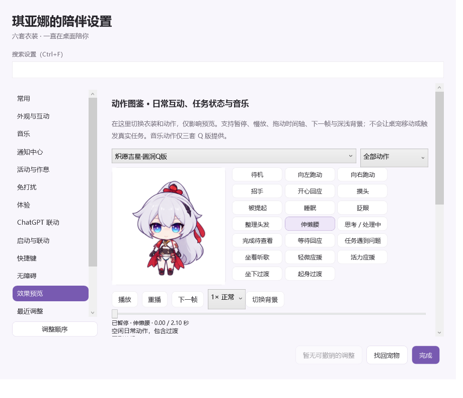
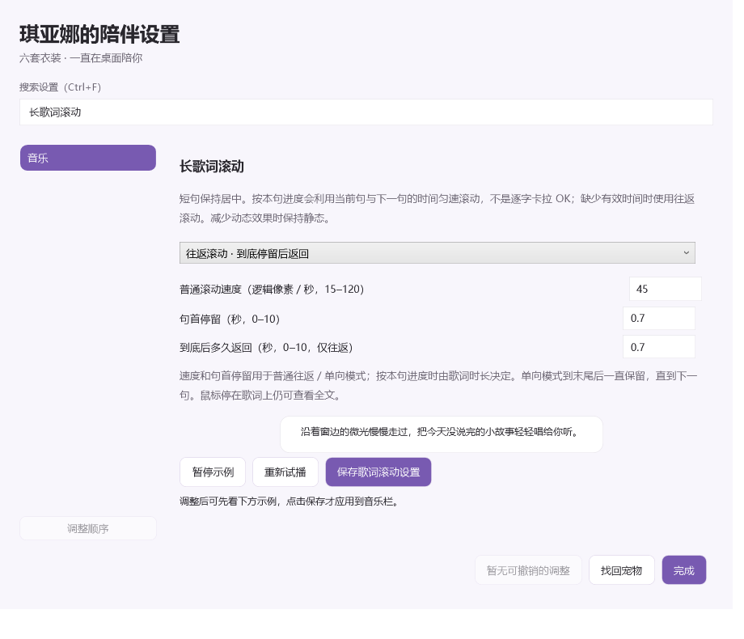

# 动画预览与长歌词设置

适用版本：0.8.4 及以后。

## 动作图鉴

打开 **设置 → 效果预览 → 动作图鉴**。这里使用桌宠实际的绘制素材和动作帧序列，当前提供20类动作：

| 分类 | 动作 |
| --- | --- |
| 日常互动 | 待机、向左／向右跑动、招手、开心回应、摸头、被提起、睡眠、眨眼、整理头发、伸懒腰 |
| 任务状态 | 思考／处理中、完成待查看、等待回应、任务遇到问题 |
| 音乐 | 坐着听歌、轻微应援、活力应援、坐下过渡、起身过渡 |

上方选择衣装和分类，点击动作即可查看；动作按钮的悬浮提示说明通常何时出现。支持暂停、重播、下一帧、时间轴定位、半速／四分之一速度和切换深浅背景。下一帧会跳到下一个不同的绘制姿态，便于检查长时间停留的动作。

切换预览衣装不会修改桌宠正在穿的衣装，也不会移动实际桌宠、发送通知或控制音乐播放器。离开页面及关闭设置后停止预览计时。开启“减少动态效果”时，图鉴默认暂停，可手动播放检查。

音乐专用动作仅三套 Q 版提供。普通三套不支持的音乐按钮会禁用；日常补充动作使用各自实际的基础动作回退。图鉴演示人物动作，跑动不会带着设置窗口移动。原有通知与气泡试播保留在图鉴下方。

## 长歌词滚动

打开 **设置 → 音乐 → 长歌词滚动**，也可以在设置搜索框输入“长歌词滚动”。调整后先看示例，再点击 **保存歌词滚动设置** 应用到实际音乐栏。

| 方式 | 显示行为 |
| --- | --- |
| 往返滚动 | 在句首停留，向左滚到句尾，等待指定时间后返回；本句期间循环 |
| 单向滚动 | 在句首停留，向左滚到句尾后一直停住，换句重新开始 |
| 按本句播放进度 | 利用本句与下一句时间戳，随播放进度从句首滚向句尾，不往回 |
| 不滚动 | 超过音乐栏宽度的内容用省略号显示 |

普通滚动速度可设为 **15–120 逻辑像素／秒**；句首停留及到底后返回等待均可设为 **0–10秒**。速度和句首停留适用于往返／单向；返回等待只适用于往返。进度模式由本句持续时间决定速度，相关输入会禁用。

进度模式是按句时间同步，**不是逐字卡拉 OK**，不分析音频。拖动音乐进度后会重新定位；相同文字在不同时间出现也视为不同句。最后一句使用歌曲总时长作为结束时间，缺少有效起止时间则回退普通往返。播放状态短暂过期时只做有限时间补偿，不会一直自行前进。

短歌词始终居中。暂停音乐、隐藏歌词或开启“减少动态效果”时停止滚动；长句静态省略，鼠标停在实际歌词上可查看全文。歌词页示例独立循环，不控制网易云音乐。

默认保持原来的往返滚动：45逻辑像素／秒，句首和句尾各停留0.7秒。四个新选项会随通用偏好导出／导入；更新不会强制替换已保存的选择。

