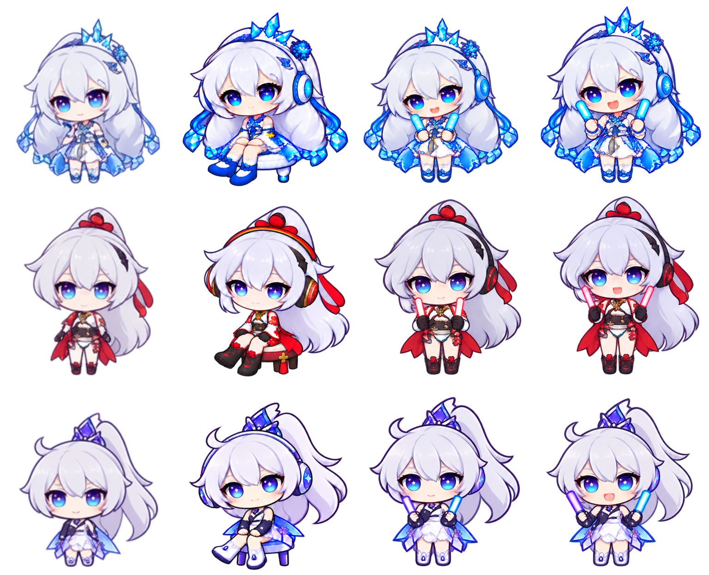

# 音乐互动与三套 Q 版动画

## 设置是什么意思

打开 **设置 → 音乐 → 音乐动作：平时与副歌分别设置**。音乐栏右键也能为当前歌曲分别设置两个阶段。

| 选项 | 实际行为 |
| --- | --- |
| 平时播放时 | 没进入已知副歌时使用的动作 |
| 进入副歌时 | 只有进入接口或手动标记的副歌区间才使用 |
| 保持平时动作 | 副歌也延续平时的动作，包括交替展示 |
| 坐着听歌＋偶尔轻微应援 | 以坐着听歌为主，约45秒后起身轻微挥棒约15秒，再坐下，循环展示 |
| 坐着晃身听歌 | 侧坐小圆凳、戴耳机，轻晃头身和腿脚，手放低；鞋尖朝人物侧坐的同一方向 |
| 轻微挥棒 | 胸前小幅挥动两根应援棒，耳机保留 |
| 活力挥棒 | 连续抬手、举棒、回落，耳机保留 |
| 不做音乐动作 | 该阶段使用原来的待机／活动规则 |

可以设置“平时交替坐着听歌与轻微应援，副歌活力挥棒”，也可以平时固定轻微挥棒、到副歌仍保持。**没有副歌数据就使用平时动作**，不是自动切回某一种模式。界面会直接显示当前生效的两阶段规则。

“这首歌”可以分别覆盖平时／副歌，默认跟随整体；副歌选“保持平时动作”跟随的是该曲实际的平时设置。最多保存100首歌曲，随通用偏好导出导入。旧版的安静／轻柔／活力／关闭设置会迁移为原来的出现规则，不会无故改变旧偏好。

连续稳定播放约8秒后开始。短暂停顿收棒，暂停超过3秒退出；切歌重新等待。拖动播放进度按新位置判断副歌；交替展示按播放会话计时，不把晃腿或挥棒宣称为实时节拍同步。摸头、拖动、睡眠、免打扰、菜单、通知操作和ChatGPT活动状态优先。“减少动态效果”开启时不自动播放音乐动作。

## 预览与视觉检查

设置页的“音乐动作预览”使用实际运行时素材，不修改音乐播放或偏好。另有可直接在浏览器打开的 [三套动作动态对照](demo/music-motion.html)，可切换背景、暂停、逐帧查看和重播坐下／起身。

每套：坐姿6帧、轻微挥棒6帧、活力挥棒6帧、坐下过渡6帧，起身反向播放。每个动作单独保存1024×1536透明图集，避免把所有小图挤在一张图里。播放按经过时间推进，三种动作有不同停留节奏；音乐活动期间33毫秒调度检查。**这是逐帧动画，不是每秒30张独立绘画，也不是真实歌曲BPM驱动。**

保留生成的alpha通道。源图透明像素的RGB可能含颜色，应按alpha合成，不按预览底色判断。运行时排除裁切范围里不属于当前姿态的零碎邻格像素，保留主体和凳子及原来的抗锯齿边缘。按原待机头部、脚底和透明留白校准；同一循环使用统一缩放，避免每个姿态忽大忽小。坐姿不会单独按整图高度撑满站姿画布。输出使用768×832帧缓存和高质量平滑采样，换装后释放上一套音乐帧缓存。



## 副歌时间

自动查询请求 `https://music.163.com/api/song/chorus?ids=[歌曲ID]`。这是非官方数据接入，不能保证每首歌曲都有数据或包含每一段副歌；不根据音量猜测，不录制音频。开关可关闭自动查询；手动标记仍然有效。

请求只含歌曲ID，不发送歌词、音频或账户凭证。校验返回ID和时间区间，毫秒转换为秒；有结果缓存30天，无结果缓存1天，失败至少5分钟后重试，缓存最多300首，位于运行目录`chorus-cache.json`。失败时使用有效缓存，没有区间就保持平时动作。

先“标记副歌起点”，再在终点标记；手动区间优先于自动数据，每首目前支持一个区间，清除后恢复接口数据。副歌起点前约1秒切入，终点切回平时动作。

## 素材与生成记录

使用内置 **image_gen** 生成与编辑，没有使用CLI/API后备模式。角色参考为仓库原有三套Q版素材；所有项目素材都已复制到`assets/`，不依赖本机生成目录。每套文件：

- `*-round-music.png`：侧坐倾听。
- `*-round-music-gentle.png`：轻微挥棒。
- `*-round-music-lively.png`：活力挥棒。
- `*-round-music-sit.png`：坐下／起身。
- `music-sprite-calibration.json`：实际裁切矩形、头部尺寸和脚底／凳脚锚点。

下面保留采用的提示词规范及最后修订要求。图集校准与深浅背景校验使用运行时同一条渲染路径。素材适用`ASSET_NOTICE.md`，不属于代码的MIT授权。

### 通用连续姿态规范

```text
Production sprite sheet exactly TWO columns THREE rows, SIX consecutive animation frames, transparent RGBA, portrait canvas. Image1 defines EXACT approved chibi Kiana proportions, costume, big head and small compact body. Image2 provides music headphones/rods and continuity reference only. Match image1 proportions and bright lively blue-cyan eyes with white star catchlights, crisp fine purple contours, richly detailed shading. Very important: equal character HEAD SIZE throughout all6 frames, no scale/camera change. Complete hair, headgear, hands, props and feet in each frame. Each character uses no more than 85% of cell width and 85% of cell height: spacious TRUE TRANSPARENT margins on ALL sides of every cell and overall sheet. No overlapping cells, no cropping, no ground shadows, no halo/glow haze, no noise flecks, no text/labels/grid. Opaque white hair. Same asymmetric costume and hair direction EVERY frame; never mirror. Headphones stay on. These are consecutive poses of one cyclical animation with small incremental movement and follow-through, not different scenes. Read left-to-right then next row.
```

### 轻微挥棒

```text
GENTLE LIGHTSTICK SWAY: Both short sticks stay low chest level, headphones worn. Six continuous poses 1 upright sticks inward; 2 wrists and shoulders sway left slightly; 3 left sway maximum6degrees sticks angledleft; 4 center relaxed blink; 5 right sway maximum6degrees sticks angledright; 6 returning toward center halfway. Feet planted. Cheerful soft smile. Hair/skirt follow with small delayed movement. Hands hold BOTH sticks always. Sticks colored inside with clean solid contour, ZERO outer glow.
```

### 活力挥棒

```text
ENERGETIC LIGHTSTICK ARM CYCLE: TWO sticks always, headphones remain. 1 sticks at shoulder height elbows bent preparation; 2 elbows extend half way upward; 3 arms high wide V with tiny on-toes bounce; 4 elbows bend halfway downward as heels lower; 5 sticks low near chest knees tiny bend preparing next bounce; 6 arms rise back toward shoulder startingpose. Continuous coherent UP then DOWN cycle, not random poses. Hair and skirt follow movement gently. Bright open joyful eyes, mouth smiling. Same size large round face everyframe. Body never shrinks or changes scale. No leg kick. Solid colored rod interiors, ZERO outer glow.
```

### 坐姿腿部方向与交替

```text
Create SIX ANIMATION FRAMES for the exact seated headphone-listening Kiana in attached reference. Preserve exact costume, bright starry eyes, large head/tiny body proportions, gentle head sway and the stool. Change leg choreography to a CLEAR ALTERNATING relaxed side-view leg swing. BOTH knees and BOTH boot toes point toward SCREEN LEFT. Soles face DOWN, never the camera. Do not rotate shoes to face us.
2 columns by3rows, read left-right top-bottom. Pose1: FAR shin extends forward LEFT about20degrees, NEAR shin hangs vertically. Pose2: both shins passing midway with knees fixed. Pose3: NEAR shin extends forward LEFT20degrees, FAR shin hangs vertically. Pose4: both shins passing midway, slight blink. Pose5: FAR shin forward again, NEAR vertical, headtiltotherway. Pose6: passing midway approaching NEAR shin forward. Swap which knee connects to the forward shoe, NOT only the shoe's vertical height. Knees remain in their same natural seated positions, shins pivot at knees, both shoes still facing LEFT. The raised near ankle moves ~45px left at512px cell scale, far ankle returns beneath its knee. The near leg slightly overlaps the far leg naturally in perspective.
Forward shoe shows SIDE and UPPER surface, never bottomsole. Feet belowknees, no highkick. Same SHORT legs as reference. Stool level fixed in allframes. Handsonthighs, headphones, gentle headtilt and hairfollowthrough, camera and headsizefixed. TrueRGBA transparency no outerglow/haze/floorshadow/text/grid. Crisp detailed fineviolet lineart. Complete fullbodyposes with24px margins.
```

### 坐姿头身比例修订

```text
Refine this exact SIX-frame sheet to the original VERY COMPACT CHIBI BODY proportions. Preserve the face/head/hair scale, facial style, sparkling eyes, costume, headphones, action and same side-facing feet. The current body below the chin is too long.
SHORTEN ONLY the torso, upper arms, thighs and shins: the full neck-to-shoe height should be about 40% SHORTER than current, while the head/face and its ornaments stay exactly same size. Keep natural joints and clothing detail, do not merely rescale the entire character. Match about 65-70% of seated figure height occupied by head including crown and hair, tiny compact torso and short little legs like the approved reference. Stool correspondingly low/compact, fits the seated short thighs and dangling feet. Both feet face sideways same direction, soles down, NEVER toward viewer. Preserve alternating shin motion, natural seated20-35degreeorientation, handsonlap. Same figureproportions ALL6 frames. Maintain24px transparent margins2cols3rows. Actual clean alpha, no shadow/glow, keep hair opaque. Do not enlarge/reduce the canvas or globally scale the whole figure.
```

### 坐下／起身过渡

```text
以原有 ambient 图集为人物比例参考、最终坐姿为凳子与耳机参考。六帧站立、屈膝、降低重心、接近凳面、坐下、放松；站立总高约1.5个头，人物原有大头短身比例；头部大小与镜头固定，短腿鞋尖朝侧方、鞋底朝下；保留明亮眼神，透明背景与每格留白。反向播放用于起身。
```
