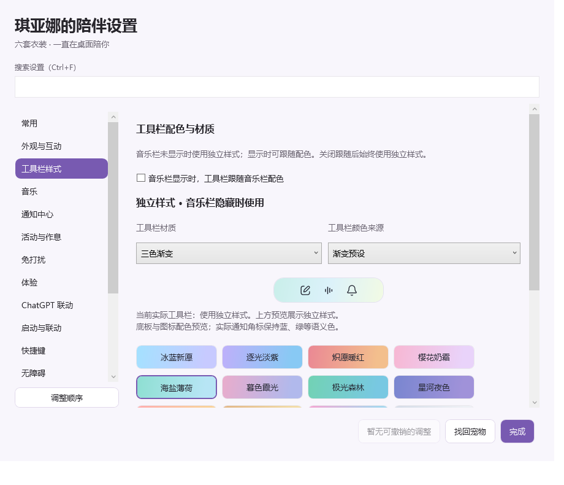
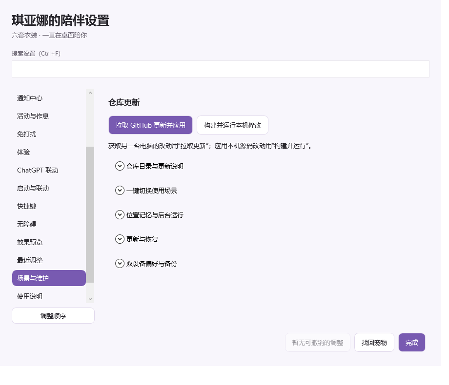

# 工具栏样式与设置整理

入口：**设置 → 工具栏样式**。工具栏有自己的材质、颜色与透明度，音乐栏没显示时也能使用。

| 音乐栏状态 | 开启「音乐栏显示时，工具栏跟随音乐栏配色」 | 关闭跟随 |
| --- | --- | --- |
| 正在显示（含选择保留的暂停卡片） | 跟随音乐栏的配色、渐变和浓淡 | 使用独立样式 |
| 悬停卡片收起、音乐栏关闭、未连接或连接过期 | 恢复独立样式 | 使用独立样式 |

独立样式会被保留，跟随期间无需重新选择。音乐栏收起时恢复毛玻璃或渐变；音乐栏出现时收起独立玻璃底板，避免叠加两套底色。默认独立样式仍为「原有简洁」，保留旧跟随开关的开关值。选择一种渐变或毛玻璃并点选配色即可设置；设置页始终预览独立样式，并标明实际工具栏当前使用哪一种。偏好可撤销，也可导出、导入到另一台设备。

## 先选材质，再选颜色

| 材质 | 效果 |
| --- | --- |
| 原有简洁 | 中性简洁底色，同样支持按音乐栏是否显示切换 |
| 纯色半透明 | 单一底色与独立不透明度 |
| 双色渐变 | 两种颜色沿指定方向过渡 |
| 三色渐变 | 三个颜色节点 |
| 棱镜炫彩 | 多个混色节点形成丰富色带 |
| 极光柔光 | 偏侧的柔和放射渐变 |
| 中心光晕 | 从中心扩散的柔和渐变 |
| 丝绸渐变 | 颜色往返交织的条带 |
| 轻透毛玻璃 | 系统背景模糊，叠加可调渐变色层与细描边 |

预设提供冰蓝新愿、逐光淡紫、炽愿暖红、樱花奶霜、海盐薄荷、暮色霞光、极光森林、星河夜色、蜜桃汽水、琥珀香槟、虹彩糖果、雾白银灰。点击预设会启用它；如果原先是简洁样式，会切换到三色渐变。

颜色来源还可选择手动三色、音乐封面、当前服装、附近背景色。封面不可用或背景读取失败时使用所选预设。音乐封面来源使用工具栏自身的强度与材质；跟随开关则在音乐栏显示时沿用音乐栏配色，两者作用不同。

## 可调细节

- 色彩强度：0–100；0 接近主题中性色，100 使用完整配色。
- 底板不透明度：15–100；只影响底板，图标与通知角标不会一起变透明。
- 渐变方向：横向、纵向、两个斜向；放射渐变使用自身光源位置。
- 缓慢流动：默认关闭，周期可调 5–60 秒；纯色不流动，减少动态效果时也停止。
- 手动颜色：三种底色、图标色、描边色，填写 `#RRGGBB`；关闭自动深浅图标后手动图标色生效。
- 玻璃雾度：控制玻璃上方的色层遮盖，系统模糊半径由 Windows 管理，不能独立调节。想更明显看到系统材质，可适当降低底板不透明度。

附近背景色只在工具栏可见且未拖动、未处于菜单让层时读取，每秒取周围少量屏幕像素并缓慢过渡。它取的是附近可见画面，不是专门读取壁纸；不会保存或发送画面。

系统毛玻璃使用 Windows 的 Desktop Acrylic。该接口要求 Windows 11 Build 22621 或更新系统；实际观感受系统透明效果等设置影响。不支持时自动使用半透明渐变，不反复报错。它是位于工具栏下方的独立底板，图标不模糊、不抢焦点；打开外部菜单、隐藏桌宠和退出时同步处理。设置页预览展示配色，系统玻璃效果请在实际桌宠上查看。[微软系统背景材质说明](https://learn.microsoft.com/en-us/windows/win32/api/dwmapi/ne-dwmapi-dwm_systembackdrop_type)

通知角标继续使用蓝色处理中、绿色完成等状态颜色。

## 设置页收纳（0.8.13）

- **场景与维护**：首屏为「拉取 GitHub 更新并应用」「构建并运行本机修改」。仓库目录、场景、位置记忆、恢复与双设备偏好分别展开；未绑定仓库时给出提示。
- **常用**：增加前往更新与构建的入口。
- **通知中心**：通知中心和测试按钮前移；外观、合并节奏、本地任务预留接口集中管理，移除维护页重复开关。
- **启动与联动**：按需打开软件与修复入口前移，自动启动开关单独分组，默认仍关闭。
- **体验**：先选走动预设，自定义速度、距离和停留参数按需展开；选「自定义」自动展开。
- **免打扰**：临时开关和当前状态在前，应用与时段规则分组；已启用规则初次打开时展开。
- **外观与互动、活动与作息、快捷键、无障碍、使用说明**：保留主要控制，收纳长说明，快捷键状态前移，键盘操作按钮并排排列。
- **效果预览**保留动作图鉴与现有交互，**最近调整**保留调整记录。自定义侧栏顺序不重置。

音乐页首先显示打开／连接网易云音乐及当前状态，之后是显示、歌词和常驻等常用开关。进入听歌、音乐动作、单曲副歌、位置、尺寸、配色与歌词滚动分别折叠。

ChatGPT 联动页首先显示打开 ChatGPT、检查修复和状态；后台 Mini 的详细说明与运行记录入口收在可展开区域。

搜索会自动展开匹配分组；清空搜索后恢复搜索前的展开状态。侧栏仍支持调整顺序，工具栏样式也可以自由移动。

[音乐页布局](demo/music-settings-compact.png) · [ChatGPT 页布局](demo/chatgpt-settings-compact.png)
